# Individuell fördjupning VG-uppgift
```
Kurs: Introduktion till yrkesrollen och grunderna i IT-infrastruktur (MYH 2025/4008)

Examinationsform: Individuell teknisk fördjupningsuppgift (Summativ examination)

Av: Blossom Davis
Datum: 2026-10-02
```

## Moment A: Avancerad Nätverksanalys & Trafikflöden
*Illustration av datatrafikflöde och TCP/IP:*

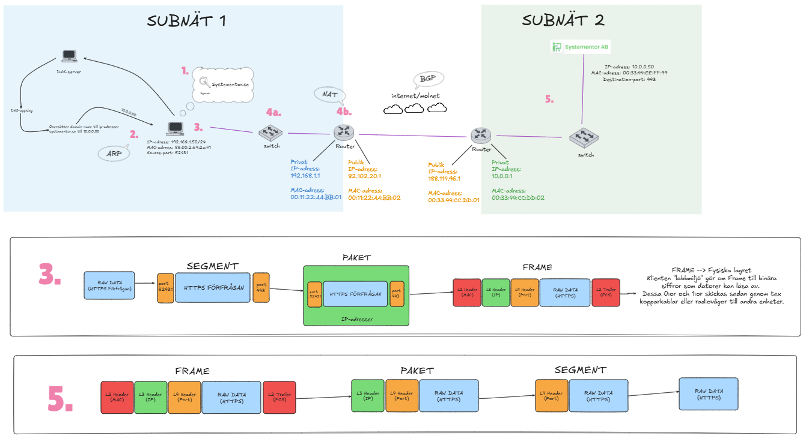

### Vad händer - steg för steg
**1. DNS-uppslag**

Klienten "Labbmiljö" vill nå hemsidan "Systementor.se". För att datorn ska veta att vi vill komma till systementor.se används: DNS-uppslag. 

Datorn skickar en förfrågan till DNS-servern, även kallad Domain Name System som översätter sökningen 
"systementor.se" till en publik IP-adress, som sedan returneras till datorn. 

**2. Destination och Gateway**

Nu har datorn fått IP-adressen till målet, dock ligger IP-adressen utanför nätverket. För att kunna ta oss till det andra subnätet behövs det att data skickas genom 
Standard Gateway (routern).

Om datorn inte har MAC-adressen till routern  används ARP (Adress Resolution Protocol), den hjälper datorn att hitta MAC-adressen som tillhör routerns IP-adress.

**3. Inkapslingen (TCP/IP-modellen)**

Nu byggs datapaketet ihop (uppifrån och ner) på klienten. 

- **Applikations lagret** genererar datan - en förfrågan om att besöka systementor.se. 

- **Transport lagret** lägger på en TCP-header med en slumpmässig (52431) source-port och en destination-port (443 för https). 

*Applikations och Transport lagret skapar ett "segment".*

- **Nätverks lagret** lägger på en IP-header med datorns lokala IP som source och "systementor.se" publika IP som destination. 

*Segmentet och IP-header skapar ett "paket"*

- **Länk lagret** kapslar in paketet i en "frame" där den lägger på sin egen MAC-adress som source och routerns MAC-adress som destination. 

- **Fysiska lagret** omvandlar frame:n till elektriska signaler eller radiovågar (bits) och skickas genom kabeln eller luften. (*Den lila kopplingen symboliserar elektricitet genom kabel för att överföra bits.*)

**4. Lokal överföring**\
**4a. Switchen**\
Switchen tar emot signalerna och läser destinationens MAC-adress och skickar vidare den till rätt port som leder till routern. 

**4b. Routern**\
Routern tar emot den och dekapslar frame-header och trailer för att visa paketet. Sedan läser den av destinationens (systementor.se) IP-adress i IP-header, för att veta vart den ska. 

Routern byter ut datorns privata IP-adress till routerns publika IP-adress, via Network Adress Translation (NAT). Routern packar sedan in paketet i en ny frame (med nya MAC-adresser) justerad till nästa nätverk och skickar det vidare till internetleverantören (ISP).

**5. Transport över Internet**\
Men innan den har nått destinationen så har den hoppat mellan ett flertal routrar över internet (BGP-protokollet). 

Till sist när paketet når destinationen passerar den brandväggar och en Load Balancer som dirigerar trafiken rätt. Servern tar emot paketet, dekapslar paketet och hanterar TCP-handskakningen och förbereder ett svar.

Svaret skickas tillbaka på samma sätt, den omvända vägen.


## Moment B: Jämförande OS- och Behörighetsanalys
*Dokumentation av ett företagscenario där syftet är att sätta behörigheter i två olika OS, med anledning av tex Least Privilege Principle.* 

### Linux
#### Steg 1 - Skapa grupper
```
sudo groupadd g_ledare
sudo groupadd g_personal
```
- sudo - ger administratörsrättigheter

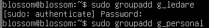

#### Steg 2 - Skapa användare
```
sudo useradd -m -g g_ledare alice
sudo useradd -m -g g_personal bob
```

-m = skapar automatiskt en hemkatalog\
-g = sätter användarens primära grupp

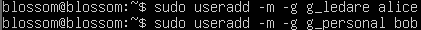

#### Lösenord för båda användarna
```
sudo passwd alice
sudo passwd bob
```
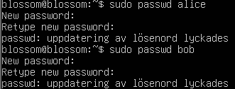

#### Steg 3 - Skapa mappstruktur
```
sudo mkdir -p /Projekt/Gemensamt /Projekt/Ledning
```
-p = skapar alla mappar (även om de inte finns) utan felmeddelande

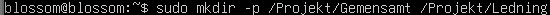

#### Steg 4 - Konfigurera ägarskap och POSIX-behörigheter för båda mapparna

För mappen Ledning vill vi att gruppen g_ledare äger mappen och har fulla rättigheter, medan övriga saknar rättigheter helt. 

```
sudo chown root:g_ledare /Projekt/Ledning

sudo chmod 770 /Projekt/Ledning
```
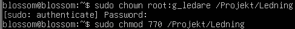

Egentligen kan en mapp bara ägas av en grupp. Så för att g_ledare och g_personal ska ha tillgång till /Projekt/Gemensamt lägger jag till alice i gruppens g_personal. 

```
sudo usermod -aG g-personal alice
```
-a = lägger till användaren i gruppen utan att ta bort användaren från andra grupper som den redan tillhör\
-G = betonar att det är en sekundär grupp som den avser

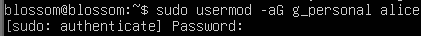

Sedan för mappen Gemensamt vill vi att gruppen g_personal äger mappen och har fulla rättigheter, medan övriga saknar rättigheter helt. 

```
sudo chown root:g_personal /Projekt/Gemensamt

sudo chmod 770 /Projekt/Gemensamt
```

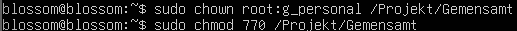

#### Steg 5 - Hantera arv (automatiskt)

Dock blir frågan vem som kommer bli grupp/ägare när alice skapar en fil i Gemensamt. För att lösa detta kan man använda SGID-biten (Set Group ID). Då kommer alla nya filer som skapas i mappen automatiskt att ärva mappens gruppägare, oavsett vem som skapar filen.  

```
sudo chmod 2770 /Projekt/Gemensamt
```

2 = aktiverar SGID-biten på mappen

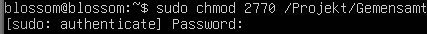

Arv till mappen /Projekt/Ledning
```
sudo chmod 2770 /Projekt/Ledning
```
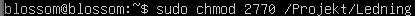

#### Steg 6 - Testa och verifiera (tillträde och filskapande)
#### alice testar /Projekt/Gemensamt
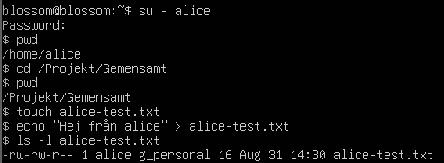

**alice testar /Projekt/Ledning**

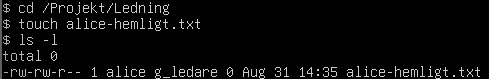

**bob testar /Projekt/Gemensamt**

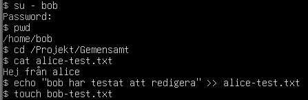

**bob testar /Projekt/Ledning**

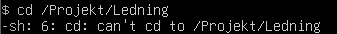


### Windows
#### Steg 1 - Skapa grupper
```
New-LocalGroup -Name "g_ledare"
New-LocalGroup -Name "g_personal"
```

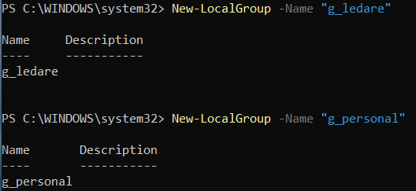

#### Steg 2 - Skapa användare
```
New-LocalUser -Name "alice"
New-LocalUser -Name "bob"
```
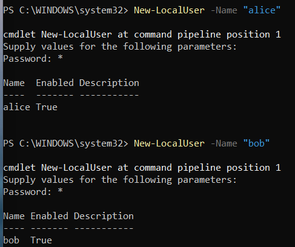

Lägger till alice och bob som medlemmar i grupperna.
```
Add-LocalGroupMember -Group "g_ledare" -Member "alice"
Add-LocalGroupMember -Group "g_personal" -Member "bob"
```
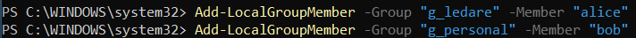

#### Steg 3 - Skapa mappstruktur
```
New-Item -Path "C:\Projekt\Gemensamt" -ItemType Directory -Force
New-Item -Path "C:\Projekt\Ledning" -ItemType Directory -Force
```
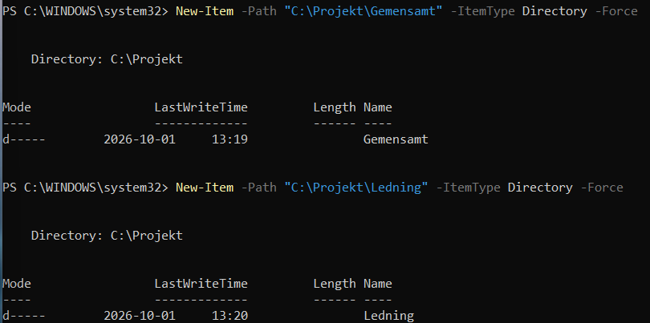

#### Steg 4 - Konfigurera NTFS behörigheter och hantera arv (inheritance)
Nu vill vi ta bort/stänga av arvet från mappen, så inte vanliga användare får läsrättigheter av misstag. 

```
icacls "C:\Projekt\Gemensamt" /inheritance:r
```
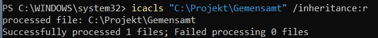

Detta ger admin och system full åtkomst. 
```
icacls "C:\Projekt\Gemensamt --% /grant:r "Administratörer:(OI)(CI)F"

icacls "C:\Projekt\Gemensamt --% /grant:r "SYSTEM:(OI)(CI)F"
```
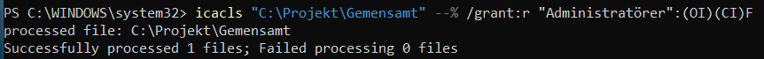

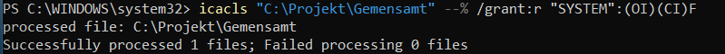

Ger personal och ledare behörigheter att läsa och skriva.

```
icacls "C:\Projekt\Gemensamt --% /grant:r "g_personal:(OI)(CI)M"

icacls "C:\Projekt\Gemensamt --% /grant:r "g_ledare:(OI)(CI)M"
```

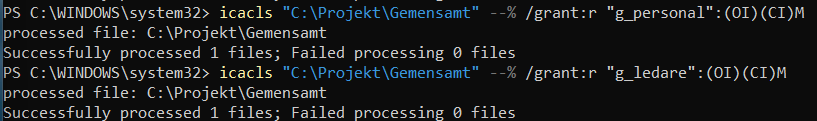


Tillåter mappen /Projekt/Ledning gruppen g_ledare men nekar gruppen g_personal. 

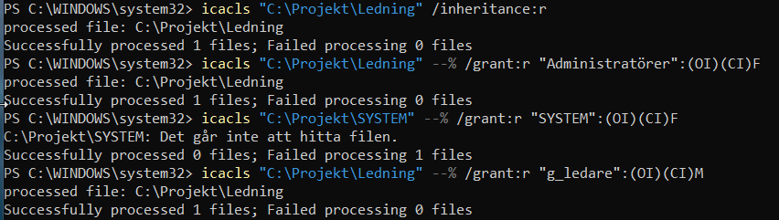

Eftersom jag stoppade ärvda rättigheter och inte gav g_personal någon behörighet, blir g_personal automatiskt nekade, utan en deny-regel.

Översikt av behörigheter:
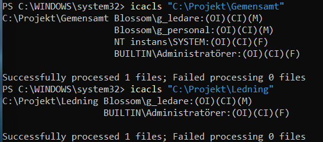

#### Steg 6 - Testa och verifiera
**alice testar att skapa filer**

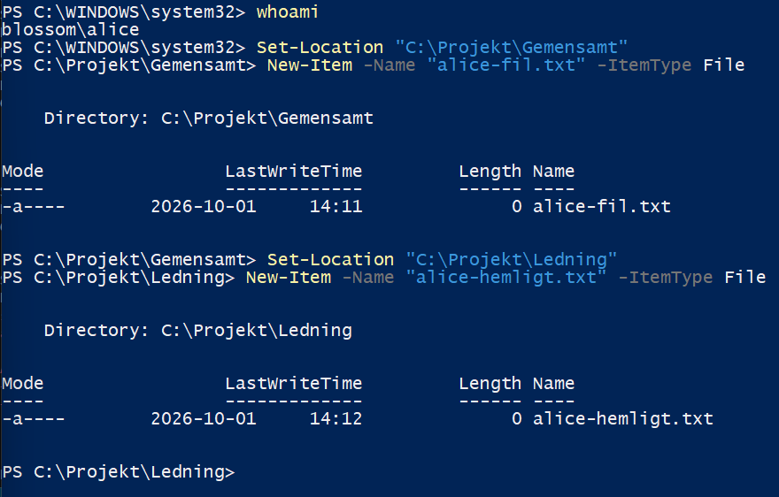

**bob testar att lista och skapa filer (ÅTKOMST NEKAD)**

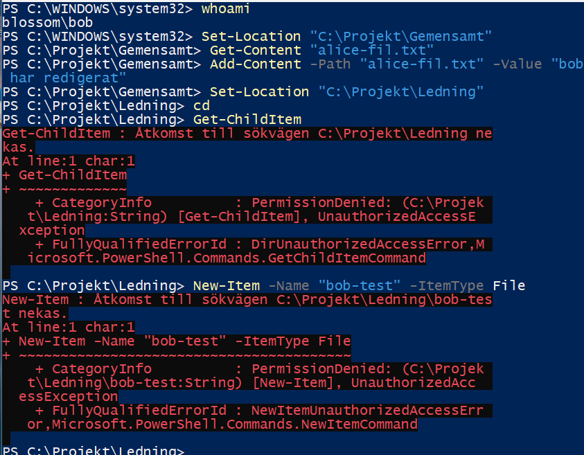


### Analys
*Jämförelsetabell:*


| Linux | Windows |
|----------|----------|
| Enkel modell. | Mer detaljerade inställningar för specifika användare/grupper. |
| Tre nivåer: User, Group, Others. | Ingen strikt indelning. |
| Tre rättigheter: Read, Write, Execute. | Flexibel. |

### Arv
Windows (NTFS): använder arv som standard. När man skapar en fil så får filen automatiskt samma rättigheter som mappen den ligger i. Man kan ändra rättigheterna eller ta bort arvet. 

Linux (POSIX): Använder inte automatiskt arv, utan "standard-rättigheter". Behörigheter sätts efter systemets standardmask - umask. Man kan ändra detta genom inställningen Set Group ID (SGID). 

### Slutsats 
**Linux** är mer förutsägbara och enkla i sin administration. User, Group och Others-strukturen gör det enkelt att se helheten och vem som har tillgång till vad. Dock blir det standardiserade arvet "osynligt", vilket gör det svårt att undvika misstag. Linux är stabil och lätt att använda men kräver mer manuell konfiguration med mer avancerade behörigheter. 

**Windows** är mer flexibla och erbjuder att man ska kunna skräddarsy detaljerade listor med behörigheter. Det automatiska arvet gör det enklare för stora organisationer att konfigurera. Flexibiliteten kan dock göra det mer utmanande med säkerheten med "labyrinter" och överlappande arv. 